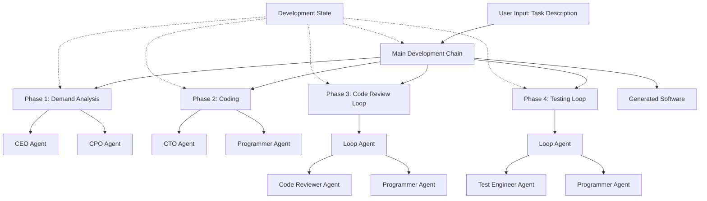

# Building a ChatDev-like Multi-Agent System with Google ADK

## Project Overview

Build a minimal viable multi-agent software development system using Google ADK that replicates ChatDev's core workflow. The system will use Google Gemini models and ADK's workflow agents to orchestrate multiple specialized agents that collaborate to develop software from natural language descriptions.

## Architecture Overview



## Project Structure

```
google-adk-chatdev/
├── README.md
├── requirements.txt
├── config/
│   ├── agent_configs.py          # Agent role definitions
│   └── prompts.py                # Phase prompts
├── src/
│   ├── __init__.py
│   ├── main.py                    # Entry point
│   ├── state.py                   # Development state management
│   ├── agents/
│   │   ├── __init__.py
│   │   ├── base_agent.py          # Base agent utilities
│   │   ├── ceo_agent.py           # CEO agent
│   │   ├── cpo_agent.py           # Chief Product Officer
│   │   ├── cto_agent.py           # Chief Technology Officer
│   │   ├── programmer_agent.py    # Programmer agent
│   │   ├── reviewer_agent.py     # Code Reviewer
│   │   └── tester_agent.py        # Test Engineer
│   ├── phases/
│   │   ├── __init__.py
│   │   ├── demand_analysis.py     # Demand Analysis phase
│   │   ├── coding.py              # Coding phase
│   │   ├── code_review.py         # Code Review phase
│   │   └── testing.py             # Testing phase
│   ├── tools/
│   │   ├── __init__.py
│   │   ├── code_manager.py        # Code extraction & management
│   │   ├── file_manager.py        # File operations
│   │   └── test_runner.py         # Test execution
│   └── chain/
│       └── development_chain.py  # Main orchestration chain
├── output/                        # Generated software storage
└── tests/
    └── test_basic_flow.py
```

## Implementation Plan

### Phase 1: Project Setup and Dependencies

**File: `requirements.txt`**

- Install Google ADK: `google-adk`
- Install Google Gemini SDK: `google-generativeai`
- Additional dependencies: `python-dotenv`, `pydantic`

**File: `README.md`**

- Project description
- Installation instructions
- Usage examples
- Configuration guide

### Phase 2: Core State Management

**File: `src/state.py`**

- Create `DevelopmentState` class extending ADK's State
- Properties:
  - `task_prompt: str` - Original user task
  - `modality: str` - Product type (Application, Website, etc.)
  - `language: str` - Programming language
  - `codes: dict[str, str]` - Code files (filename -> content)
  - `review_comments: str` - Review feedback
  - `test_reports: str` - Test execution results
  - `error_summary: str` - Error analysis
- Methods:
  - `update_codes(content: str)` - Parse and update code files
  - `get_codes_formatted() -> str` - Format codes for prompts
  - `save_to_directory(path: str)` - Write files to disk

### Phase 3: Code Management Tools

**File: `src/tools/code_manager.py`**

- `extract_code_blocks(text: str) -> dict[str, str]` - Parse markdown code blocks
- `format_code_for_prompt(codes: dict) -> str` - Format codes for LLM prompts
- `validate_code_structure(codes: dict) -> bool` - Validate code structure

**File: `src/tools/file_manager.py`**

- `create_project_directory(project_name: str) -> str` - Create output directory
- `write_files(directory: str, codes: dict)` - Write code files
- `read_file(directory: str, filename: str) -> str` - Read file content

**File: `src/tools/test_runner.py`**

- `run_tests(directory: str, language: str) -> tuple[bool, str]` - Run tests and return results
- `parse_test_errors(output: str) -> str` - Extract error summary

### Phase 4: Agent Definitions

**File: `config/agent_configs.py`**

- Define system prompts for each agent role:
  - CEO: Decision maker and coordinator
  - CPO: Product design and modality
  - CTO: Technology decisions and language selection
  - Programmer: Code writing and modification
  - Code Reviewer: Code quality review
  - Test Engineer: Testing and error analysis

**File: `src/agents/base_agent.py`**

- Base agent factory function
- Common agent configuration
- Model selection (Gemini Pro)

**File: `src/agents/ceo_agent.py`**

- CEO agent using LlmAgent with CEO system prompt

**File: `src/agents/cpo_agent.py`**

- CPO agent for product decisions

**File: `src/agents/cto_agent.py`**

- CTO agent for technology decisions

**File: `src/agents/programmer_agent.py`**

- Programmer agent with code writing capabilities
- Tools: code_manager, file_manager

**File: `src/agents/reviewer_agent.py`**

- Code Reviewer agent
- Tools: code_manager for code analysis

**File: `src/agents/tester_agent.py`**

- Test Engineer agent
- Tools: test_runner for executing tests

### Phase 5: Phase Implementations

**File: `config/prompts.py`**

- Phase prompts matching ChatDev's format:
  - Demand Analysis prompt
  - Language Selection prompt
  - Coding prompt
  - Code Review prompt
  - Testing prompt

**File: `src/phases/demand_analysis.py`**

- Create SequentialAgent with CEO and CPO
- Prompt: Determine product modality
- Extract modality from response (look for `<INFO>` marker)
- Update state.modality

**File: `src/phases/coding.py`**

- Create SequentialAgent with CTO and Programmer
- Prompt: Write code based on requirements
- Extract code blocks using code_manager
- Update state.codes
- Save files to output directory

**File: `src/phases/code_review.py`**

- Create LoopAgent wrapping SequentialAgent
- Inner agents: Reviewer → Programmer
- Condition: Continue until `<INFO> Finished`
- Max iterations: 3
- Extract review comments and update code

**File: `src/phases/testing.py`**

- Create LoopAgent wrapping SequentialAgent
- Inner agents: Tester → Programmer
- Condition: Continue if bugs exist
- Max iterations: 3
- Run tests, analyze errors, fix code

### Phase 6: Main Development Chain

**File: `src/chain/development_chain.py`**

- Create SequentialAgent combining all phases:

  1. Demand Analysis phase
  2. Coding phase
  3. Code Review phase (LoopAgent)
  4. Testing phase (LoopAgent)

- Pass state through chain
- Handle errors and logging

### Phase 7: Entry Point and CLI

**File: `src/main.py`**

- Parse command-line arguments:
  - `--task`: Task description
  - `--name`: Project name
  - `--model`: Gemini model (default: gemini-pro)
- Initialize DevelopmentState
- Create development chain
- Execute chain
- Save output
- Print summary

### Phase 8: Configuration and Environment

**File: `.env.example`**

- `GOOGLE_API_KEY`: Google API key for Gemini
- `OUTPUT_DIR`: Output directory path

**File: `config/agent_configs.py`**

- Centralized agent configurations
- Model selection
- Temperature and other parameters

## Key Implementation Details

### State Management Pattern

```python
# State is passed through the chain
state = DevelopmentState()
state.task_prompt = user_task
result = chain.run(initial_input, state=state)
```

### Code Extraction Pattern

````python
# Extract code from LLM response
def extract_code_blocks(response: str) -> dict[str, str]:
    # Parse markdown: FILENAME\n```LANGUAGE\nCODE\n```
    # Return {filename: code_content}
````

### Loop Condition Pattern

```python
# For Code Review
def review_condition(result: str, state: DevelopmentState) -> bool:
    return "<INFO> Finished" not in result

# For Testing
def test_condition(result: str, state: DevelopmentState) -> bool:
    return state.error_summary and "error" in state.error_summary.lower()
```

### Agent Communication Pattern

```python
# Agents communicate through state
# Each phase updates state
# Next phase reads from state
```

## Testing Strategy

**File: `tests/test_basic_flow.py`**

- Test with simple task: "Create a hello world program"
- Verify:
  - State updates correctly
  - Code extraction works
  - Files are written
  - Chain executes end-to-end

## Documentation Requirements

1. **README.md**: Installation, usage, examples
2. **API Documentation**: Docstrings for all classes and functions
3. **Configuration Guide**: How to customize agents and prompts
4. **Architecture Diagram**: Visual representation of the system

## Success Criteria

- System can generate a simple Python program from natural language
- Code is properly extracted and saved to files
- Review loop can iterate and improve code
- Test loop can detect and fix errors
- State is maintained throughout the chain
- Output is usable software

## Next Steps After MVP

1. Add more phases (EnvironmentDoc, Manual generation)
2. Support multiple programming languages
3. Add Git integration
4. Implement memory/learning system
5. Add web UI for visualization
6. Support incremental development
7. Add human-in-the-loop interaction

## Dependencies

- `google-adk`: Core ADK framework
- `google-generativeai`: Gemini API client
- `python-dotenv`: Environment variable management
- `pydantic`: Data validation (if needed)

## Environment Setup

1. Install dependencies: `pip install -r requirements.txt`
2. Set `GOOGLE_API_KEY` environment variable
3. Run: `python src/main.py --task "your task" --name "project_name"`